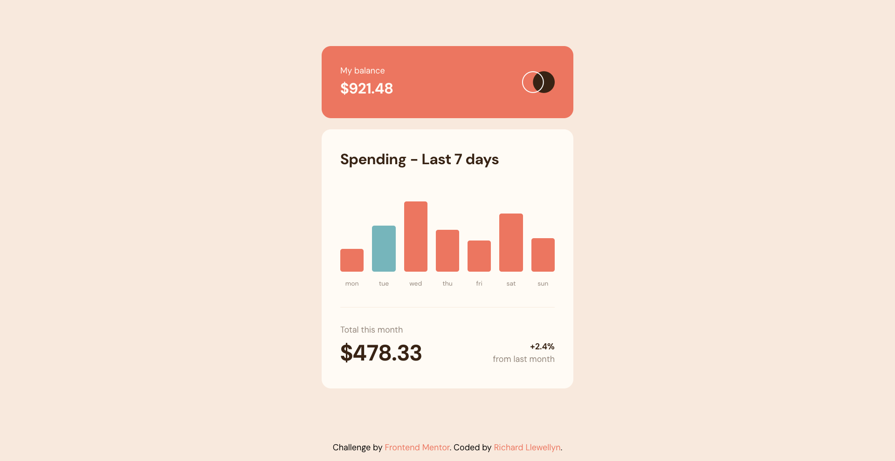

# Frontend Mentor - Expenses chart component solution

This is a solution to the [Expenses chart component challenge on Frontend Mentor](https://www.frontendmentor.io/challenges/expenses-chart-component-e7yJBUdjwt). Frontend Mentor challenges help you improve your coding skills by building realistic projects. 

## Table of contents

- [Overview](#overview)
  - [The challenge](#the-challenge)
  - [Screenshot](#screenshot)
  - [Links](#links)
- [My process](#my-process)
  - [Built with](#built-with)
  - [What I learned](#what-i-learned)
  - [Continued development](#continued-development)
- [Author](#author)

**Note: Delete this note and update the table of contents based on what sections you keep.**

## Overview

### The challenge

Users should be able to:

- View the bar chart and hover over the individual bars to see the correct amounts for each day
- See the current day’s bar highlighted in a different colour to the other bars
- View the optimal layout for the content depending on their device’s screen size
- See hover states for all interactive elements on the page
- **Bonus**: Use the JSON data file provided to dynamically size the bars on the chart

### Screenshot

### Links

- Solution URL: [https://github.com/RichLlew182/expenses-chart-component](https://github.com/RichLlew182/expenses-chart-component)
- Live Site URL: [https://richllew182.github.io/expenses-chart-component](https://richllew182.github.io/expenses-chart-component)

## My process

### Built with

- Semantic HTML5
- CSS custom properties
- Flexbox
- Javascript
- JSON
- Fetch API
- Mobile-first workflow

### What I learned

This was a bit of a refresh on some of the skills that I learned in the bootcamp, such as the fetch api. 

### Continued development

I think this could be improved using React as there is quite a bit of repetition in the html, whereas with React I could generate components based off the json file. 

## Author

- Website - [Richard Llewellyn Frond End Developer](https://richllew.dev/)
- Frontend Mentor - [@RichLlew182](https://www.frontendmentor.io/profile/RichLlew182)